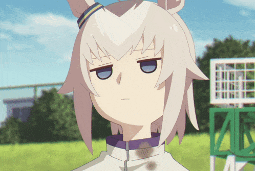

<h1 align="center">Hi 👋, I'm Mukafu G</h1>
<h3 align="center">A student at Jakarta State Polytechnic</h3>

  

🔭 I’m currently working as an <b>Art Director</b> for the game <a href="https://ladahitamcreation.itch.io/fondness-in-reveries" target="_blank">Fondness in Reveries</a> by LadaHitamCreation.
 
 
🎨 You can check out my portfolio on <a href="https://www.behance.net/gallery/226611601/Mystic-Market-Tycoon" target="_blank"><b>Behance</b></a>.
 
 
🎮 Or see our team's game projects on <a href="https://ladahitamcreation.itch.io/" target="_blank"><b>Itch.io</b></a>.

 

<h3 align="left">Connect with me:</h3>

## Languages and Tools:

<!-- Coding -->

... (other devicons) ...

<!-- Design & Art -->

<!-- Audio -->

